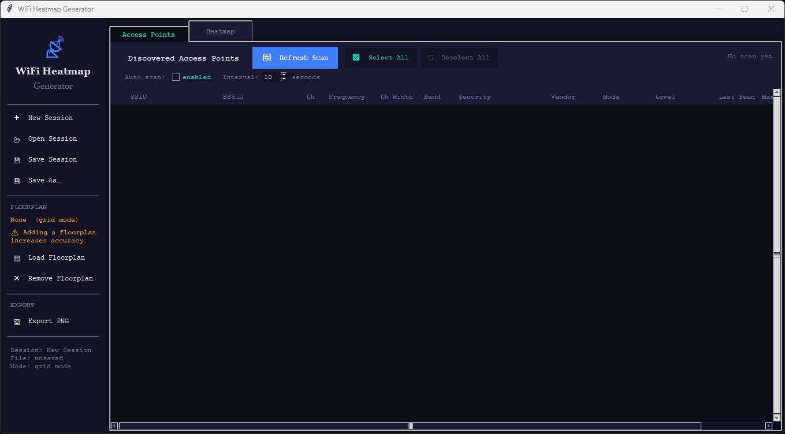
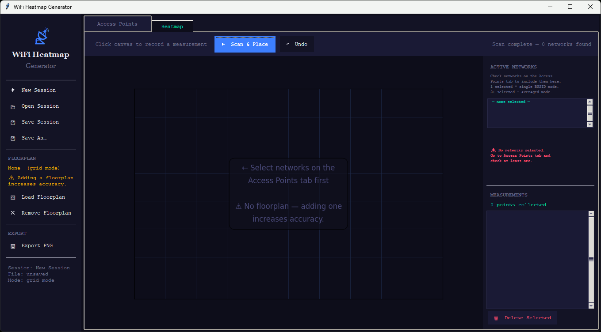
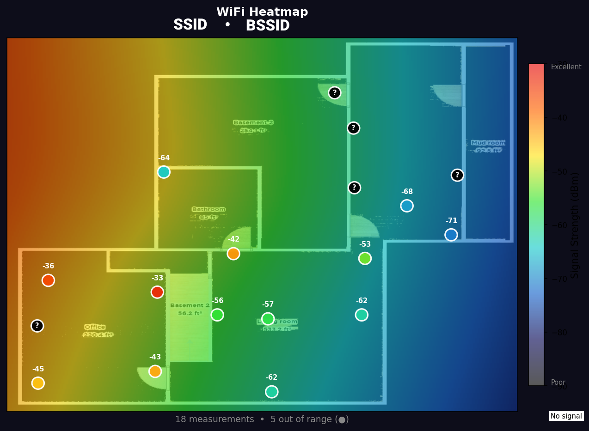

<p align="center">
  
</p>

# 📡 pyFi

A cross-platform desktop application for collecting and visualizing WiFi signal
strength across a physical space. Supports Windows, Linux, and macOS. Works
with or without a floorplan image — though providing one significantly increases
the accuracy and usefulness of the resulting heatmap.

---

## 🔌 Requirements 🔌

- Python 3.10+
- tkinter (usually bundled with Python; on Linux: `sudo apt install python3-tk`)

## ⬇️ Installation ⬇️

```bash
pip install -r requirements.txt
```

Dependencies: `numpy`, `scipy`, `matplotlib`, `Pillow`

No third-party WiFi libraries are required. The scanner uses native OS APIs
directly (`wlanapi` on Windows, `iw` / `nmcli` on Linux, `airport` on macOS).

---

## 📖 Usage 📖

```bash
# Launch the GUI
python main.py

# Load an existing session on startup
python main.py --session my_office.json
```

---

## 🗺️ Interface Overview 🗺️

The application has two tabs and a persistent left sidebar.

### Sidebar (always visible)

- **Session management** — New, Open, Save, Save As
- **Floorplan** — Load or remove a floorplan image. A note is shown when none
  is loaded reminding you that providing one increases accuracy.
- **Export PNG** — Save the current heatmap view as an image file.
- **Session info** — Shows the current session name, file path, and mode.

### Tab 1 — Access Points

<p align="center">
  
</p>

The first tab you see on launch. Shows a scrollable table (horizontal and
vertical) of every access point ever discovered during the session — including
those that have gone out of range, which remain in the list permanently and are
shown dimmed with an "out of range" indicator in the Level column. Column
headers are pixel-exact aligned to their data columns.

**Table columns:**

| Column | Description |
|---|---|
| ✓ | Checkbox to include this BSSID in heatmap rendering |
| SSID | Network name (full name, never truncated) |
| BSSID | Hardware MAC address — unique per physical radio |
| Ch | 802.11 channel number |
| Frequency | Centre frequency in MHz |
| Ch Width | Channel width (20 / 40 / 80 / 160 / 320 MHz) |
| Band | 2.4, 5, or 6 GHz |
| Security | WPA3-Personal, WPA2-Personal, WPA2-Enterprise, WPA-Personal, WEP, Open |
| Vendor | Manufacturer derived from BSSID OUI prefix (~100 vendors recognized) |
| Mode | 802.11 mode: ax (Wi-Fi 6), ac (Wi-Fi 5), n (Wi-Fi 4), g, a, b |
| Level | Color-coded signal bar (green ≥ -50, yellow -50–-65, orange -65–-75, red < -75) |
| Last Seen | How long ago this BSSID was last visible (updates each scan) |
| Max | Strongest signal ever recorded for this BSSID across all scans |
| Min | Weakest signal ever recorded |
| Avg | Running average of all valid readings |

The Max, Min, and Avg columns accumulate across the entire session lifetime and
are cleared only when starting a new session. Max is tinted green, Min red, and
Avg is color-coded dynamically by signal quality.

**Toolbar controls:**

- **🔄 Refresh Scan** — Trigger a manual scan immediately.
- **☑ Select All / ☐ Deselect All** — Check or uncheck all rows for heatmap use.
- **Auto-scan** — Enable automatic periodic scanning. The interval is
  user-configurable via a spinbox (minimum 3 seconds, default 10 seconds,
  maximum 300 seconds). A live countdown label shows time until the next scan.
  While auto-scan is active the manual Refresh button is disabled to prevent
  scan conflicts. Changing the interval mid-countdown restarts the timer.

### Tab 2 — Heatmap

<p align="center">
  
</p>

The heatmap canvas with measurement and AP placement tools.

**Toolbar controls:**

- **▶ Scan & Place** — Scan WiFi and enter placement mode; click your location on the canvas.
- **↩ Undo** — Remove the most recently recorded measurement point.
- **◆ Place APs** — Toggle AP placement mode (see AP Positions below).
- **✕ Clear AP Pins** — Remove all AP position pins from the session.

**Active Networks panel (right side):**

Shows which BSSIDs are currently selected for rendering, pulled directly from
the checkboxes on the Access Points tab. No separate dropdown is needed — the
AP tab checkboxes are the sole selector.

- **Single BSSID selected** → heatmap shows that radio's individual coverage.
- **Multiple BSSIDs selected** → signal values are averaged per measurement
  point. Only BSSIDs that were actually visible at each location contribute to
  the average — a radio that was out of range at a given spot is excluded rather
  than dragging the average down. This is the correct way to map mesh networks.

A mode label shows either "Mode: single BSSID" or "Mode: averaging N BSSIDs".

**AP Positions panel (right side):**

Shows one row per active BSSID. Each row displays:
- A status indicator: ○ (not pinned), ◆ (pinned), or ▶ (armed for placement)
- The SSID and current pin coordinates (if placed)
- An ✕ remove button when pinned

To place an AP:
1. Click **◆ Place APs** in the toolbar to enter placement mode.
2. Click a network row in the AP Positions panel to arm it (▶ indicator appears).
3. Click the AP's physical location on the canvas — a ◆ diamond marker appears.
4. Repeat for each AP. Right-click an existing ◆ marker to remove it.

Placing APs is optional but improves heatmap accuracy — see *AP Positioning* below.

**Measurements panel (right side, full height):**

A scrollable list of every recorded measurement point showing its canvas
coordinates and how many APs were visible at that location. Individual
measurements can be deleted by selecting them and clicking 🗑 Delete Selected.

**Heatmap rendering (Ekahau-style):**

- The colormap runs **red** (strongest, ≥ -30 dBm) → orange → yellow → green →
  teal → blue → **violet** (weakest, ≤ -90 dBm), matching professional site
  survey tools. Strong signal zones are warm colors; weak zones are cool.
- The alpha channel is derived per-pixel from signal strength — strong zones are
  opaque and weak/absent zones fade to transparent, revealing the floorplan
  beneath. This produces the characteristic "bubble" zone appearance.
- A Gaussian blur is applied to zone edges so overlapping coverage areas blend
  smoothly rather than showing hard triangulation boundaries.
- The heatmap is not drawn until at least **4 measurement points** are collected
  for the selected BSSID(s). Until then a progress indicator shows how many more
  are needed.
- **Colored dots** (circles) mark each valid measurement point, labeled with the dBm value.
- **Black dots with a `?`** mark measurement points where none of the selected
  BSSIDs were visible — the user was there and scanned, but that radio had no
  coverage at that location.
- **◆ Diamond markers** with WiFi arc icons mark AP physical positions when
  pinned. These are visually distinct from measurement dots and show the SSID
  label beneath the icon.
- The colorbar runs from black (no signal) at the bottom to red (excellent) at
  the top. A "No signal" label appears below the scale.
- When no floorplan is loaded, a subtle coordinate grid is drawn instead, and
  a warning note appears in the heatmap subtitle and export.

---

## Workflow

1. **Launch** the app. It opens on the Access Points tab.
2. Click **🔄 Refresh Scan** to discover nearby networks. All found networks
   are auto-selected on the first scan.
3. *(Optional but recommended)* Click **🖼 Load Floorplan** in the sidebar.
   Load a PNG or JPEG overhead image of your space. This gives the interpolation
   real spatial context and produces a significantly more accurate heatmap.
4. Switch to the **Heatmap** tab. The Active Networks panel shows your selected
   BSSIDs and the current mode (single or averaged).
5. *(Optional)* Pin your AP locations using **◆ Place APs** — see *AP Positioning*.
6. Walk to a location in your space and click **▶ Scan & Place**. The app
   scans WiFi (10 samples, 100 ms apart, median reported) and enters placement
   mode. Click your current position on the canvas.
7. Repeat from step 6. Aim for **at least 15–20 measurement points** for a
   good interpolation. Prioritize:
   - Locations very close to each router (expect -30 to -45 dBm)
   - Far corners and edges of the space (expect -65 to -80 dBm)
   - Both sides of walls and doorways
   - Any spot you suspect has poor coverage
8. The heatmap auto-updates after each new point once the 4-point minimum is met.
9. Use **Export PNG** to save the result, or **Save Session** to continue later.

### AP Positioning

When you pin an AP's physical location on the canvas, the renderer injects a
synthetic anchor point at that position into the interpolation. The anchor value
is the strongest real measurement seen for that BSSID plus 5 dBm (capped at
-25 dBm), representing the expected near-field signal directly at the
transmitter.

Without an anchor, the interpolator estimates the signal peak from surrounding
measurement points, which can place it in the wrong location — especially in a
mesh system where measurement density may not be uniform. With an anchor, the
heatmap peak is correctly located at the physical AP, and coverage zones radiate
outward from the right origin.

AP positions are saved in the session file and restored on load.

### Mapping a mesh network accurately

If you have a mesh system (e.g. Netgear Orbi, Eero, Google Nest WiFi) where
multiple radios broadcast the same SSID:

- Each physical radio has a unique **BSSID** — use the Access Points tab to
  identify them by channel, frequency, or vendor.
- To map one radio in isolation, check only its BSSID and uncheck the others
  before scanning.
- Your device will silently roam between radios as you move. If all BSSIDs are
  checked, the multi-BSSID averaging mode will produce a combined coverage map.
- For the most accurate single-radio map, consider temporarily disabling the
  other nodes in your mesh system's admin panel during the session.
- Pinning each node's physical location with **◆ Place APs** is especially
  useful for mesh systems — it anchors each radio's peak independently so the
  averaged multi-BSSID map correctly reflects all three coverage zones.

---

## Scanning Backends

The scanner automatically selects the best available backend per OS and falls
back gracefully if the primary is unavailable.

| OS | Primary | Fallback 1 | Fallback 2 |
|---|---|---|---|
| Windows | `wlanapi` via ctypes | `netsh wlan show networks` | — |
| Linux | `iw dev scan` | `nmcli dev wifi list` | `iwlist scan` |
| macOS | `airport -s` | — | — |

### Why `wlanapi` and `iw` matter 💡

**Windows — `wlanapi` vs `netsh`:**

`netsh` reports signal as a 0–100% quality score that is converted back to dBm
with `(pct/2) - 100`. Most drivers clamp everything above roughly -55 dBm to
100%, which converts to exactly -50 dBm — meaning all strong signals appear
identical and genuine variation close to the router is invisible. `wlanapi`
calls `WlanGetNetworkBssList()` directly, which returns the raw `dot11_RSSI`
field from the BSS entry struct in hardware dBm with no clamping or rounding.
This can reveal 8–15 dBm of real variation that `netsh` completely hides.
`WlanScan()` is also called first to request a fresh radio sweep rather than
reading the OS scan cache (which can be 30–60 seconds stale).

The `DOT11_SSID` struct is read using the correct SDK layout (`uSSIDLength` as
a 4-byte ULONG + `ucSSID[32]`), ensuring SSIDs are never truncated regardless
of length.

**Linux — `iw` vs `nmcli`:**

`nmcli` reads from NetworkManager's internal scan cache and applies its own
signal smoothing. `iw dev <iface> scan` calls the kernel's `nl80211` layer
directly via netlink, forcing a live hardware scan and returning signal in mBm
(millibelsmilliwatt) at 0.1 dBm precision, e.g. -6500 = -65.0 dBm. It also
returns raw Information Elements (IEs) from the beacon frame, enabling accurate
detection of HE / VHT / HT capabilities for the Mode column.

### Linux permissions for `iw`

`iw dev scan` requires either root or `CAP_NET_RAW` on the Python binary:

```bash
# Preferred: grant capability to Python (no sudo needed at runtime)
sudo setcap cap_net_raw+eip $(which python3)

# Alternative: run as root (not recommended for daily use)
sudo python main.py
```

If neither is available the scanner falls back to `nmcli` automatically.

### Windows permissions for `wlanapi`

Normal user processes have `WLAN_WRITE_ACCESS` by default on Windows 7 and
later — no elevation required. On locked-down corporate machines where this
access is denied, the scanner falls back to `netsh` automatically.

---

## 🗑️ Known limitations 🤦

If you are on Windows 11 24H2 (possibly earlier) and later versions, Microsoft *requires* Location Services to be enabled. This isn't a fault of the pyFi program, but an OS problem.

---

## Signal Sampling

Each **▶ Scan & Place** measurement takes **10 samples at 100 ms intervals**
(approximately 1.1 seconds total). The **median** of the samples is reported,
not the mean. The median discards burst spikes and interference events that
can momentarily shift RSSI 10–15 dBm in either direction, producing a more
stable reading that better represents the true signal at that location.

The Access Points tab **Refresh Scan** uses the same sampling parameters. The
**Auto-scan** feature uses the same backend but runs on a timer rather than
being placement-triggered, and accumulates running Max / Min / Avg statistics
per BSSID across the entire session.

---

## Interpolation

Signal values between measurement points are interpolated using scipy. When AP
positions are pinned, synthetic anchor points are injected at the transmitter
locations before interpolation runs.

| Points collected | Method used |
|---|---|
| < 4 | No heatmap (progress indicator shown) |
| 4–8 | Cubic (Delaunay triangulation) |
| 9+ | RBF — Radial Basis Function with thin-plate spline kernel |

RBF produces smoother, more physically plausible gradients for signal
propagation and is preferred once enough data is available. NaN cells at the
edges of the interpolation are filled with nearest-neighbor fallback so the
entire canvas is always covered.

---

## Signal Quality Reference

| dBm range | Quality | Colorbar |
|---|---|---|
| -30 to -50 | Excellent | Red → Orange → Yellow |
| -50 to -65 | Good | Yellow → Green |
| -65 to -75 | Fair | Green → Teal |
| -75 to -90 | Poor | Teal → Blue → Violet |
| Not found | No signal | Black dot (●) on map |

---

## Session Files

Sessions are saved as `.json` files containing all measurement points, signal
readings for every visible BSSID at each point, SSID mappings, AP position
pins, the floorplan path, and canvas dimensions. Sessions can be loaded at startup:

```bash
python main.py --session my_office.json
```

Measurements can be deleted individually from the Heatmap tab. AP pins can be
removed individually from the AP Positions panel or all at once via
**✕ Clear AP Pins**. The session is not auto-saved — use **💾 Save Session**
or **💾 Save As…** from the sidebar.

---

## Floorplan Tips

- Any image format works: PNG, JPEG, BMP, TIFF. PNG with transparency is supported.
- The image is scaled to fit the canvas automatically — no need to resize it first.
- Even a hand-drawn photo of a sketch works.
- **Providing a floorplan increases accuracy** — measurement points map to real
  room features, giving the interpolation genuine spatial context.
- Without a floorplan the canvas shows a coordinate grid and a warning is shown
  in the heatmap subtitle and export.

---

## Project Files

| File | Purpose |
|---|---|
| `main.py` | Tkinter GUI — two-tab layout (Access Points + Heatmap), sidebar, auto-scan engine, AP stats tracking, AP placement drag-and-drop |
| `scanner.py` | Cross-platform WiFi scanning with `wlanapi` / `iw` / `nmcli` / `airport` backends, median averaging, correct DOT11_SSID struct |
| `interpolator.py` | Spatial interpolation — auto-selects RBF, cubic, or linear based on point count |
| `renderer.py` | Ekahau-style RGBA heatmap rendering — signal-driven alpha, Gaussian zone blending, AP diamond markers, colorbar |
| `data.py` | Session model — measurements, multi-BSSID averaging, missing-point detection, AP position anchoring, JSON persistence |
| `requirements.txt` | Python dependencies (`numpy`, `scipy`, `matplotlib`, `Pillow`) |

---

## 🖼️ Screenshots 🖼️

<p align="center">
  
</p>
